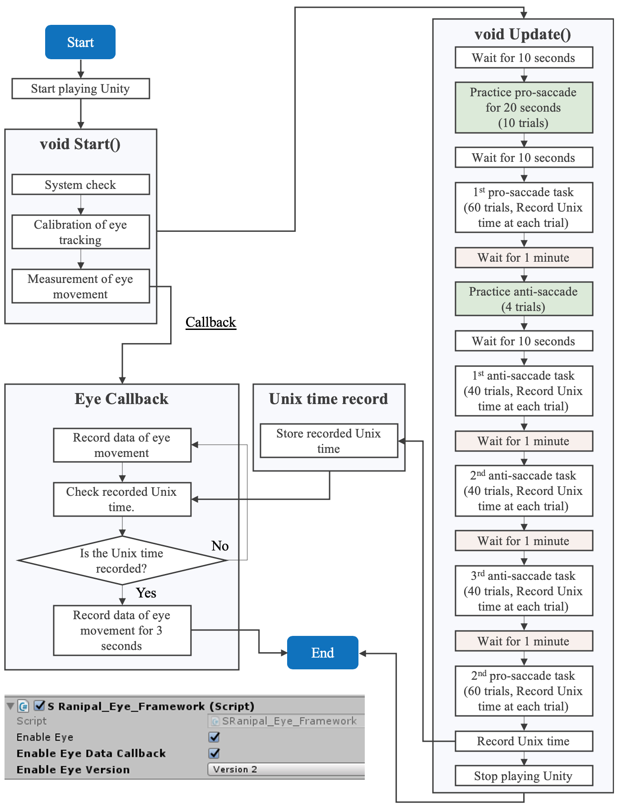

# SaccadeVR-mobile:

A software package of Unity to use HTC VIVE Pro Eye, a head-mounted display with virtual reality technology, for assessment of saccadic eye movement.
Please cite [us](https://www.frontiersin.org/articles/10.3389/fpsyt.2020.572938/) when you refer to the package!

"Assessing Saccadic Eye Movements With Head-Mounted Display Virtual Reality Technology" 
https://doi.org/10.3389/fpsyt.2020.572938 
https://doi.org/10.5905/ethz-1007-511 

## System set-up

###### Software version
The following software is used for the measurement system.
- Unity: 2019.2.5f1
- Steam VR: 1.11.11
- SRanipal, a software development kit (SDK) for eye tracking provided by HTC: 1.1.0.1
- SR Runtim: 1.1.2.0
  
***<Update on the 18th of August 2023>***  
We confirmed that the system also works with the following updated software versions.
- [Eye and Facial Tracking SDK](https://developer.vive.com/resources/vive-sense/eye-and-facial-tracking-sdk/): 1.3.6.8
- SR Runtime: 1.3.6.11
- Eye camera: 2.41.0-942e3e
- (steamVR is downloaded during the setup of VIVE Pro Eye)
- Since “the firmware is updating” message keeps appearing, the following files needs to be updated or the eye tracker needs to be activated in steam VR (please refer to the captured image below).
  File: C/Users/[user name]/AppData/LocalLow/HTC Corporation/SR_Config/SRanipalConfig.ini
        C/Users/[user name]/AppData/LocalLow/HTC Corporation/SR_Config/SRanipal_Config/SRanipalConfig.ini 
  EnableRuntimeAutoUpdate = 0
  EnableFirmwareAutoUpdate = 0

  

###### Set-up procedures
1. Open the folder of **SaccadeVR_ViveProEye** on Unity.
2. Go to Building Settings --> Player Settings --> Player --> XR Settings. Click *Virtual Reality Supported* to enable the VR configuration.
3. Start playing for the measurement.
- Please be noted that you will see Unity seem to be frozen if you click the stop button on Unity for a specific case. Unity seems to be frozen in this situation because the sampling of eye tracking is still working on the background. As explained in the following algorithm flow chart, the sampling of eye tracking works independently from Unity. The playing of Unity is stopped automatically when all the saccade tasks are completed. We set the maximum sampling number of eye tracking to 120 Hz * 1800 seconds in line# 175: **private const int maxframe_count = 120 * 1800;** of C# script: Saccade_measure_rev1.cs. Therefore, if you click the stop button on Unity within **maxframe_count** time range, Unity seems frozen (actually not because the system still waits for the sampling of eye tracking to finish). On the other hand, if you click the stop button beyond **maxframe_count** time range, the playing of Unity stops immediately. The maximum number of **maxframe_count** can be adjusted accordingly.

## Files
###### Saccade_measure_rev1.cs
C# programming file to configure the measurement system. The file is found SaccadeVR_ViveProEye --> Assets --> Scripts.

###### DisableTracking.cs
C# programming file to disable the tracking of head movement of the VR headset. If the tracking is active, the position of the stimuli targets for saccade measurement changes when the user moves the head. The file is found SaccadeVR_ViveProEye --> Assets --> Scripts.

###### StandardSaccade_IDnumber.txt
Data of eye movement are recorded in this text file. The text file is created under the folder of **SaccadeVR_ViveProEye**
The measured parameters include
- Frame sequence
- Timestamp (ms)
- Gaze origin (mm)
- Gaze direction (normalised to between -1 and 1)
- Pupil position (normalised to between 0 and 1)
- Pupil diameter (mm)
- Eye openness (normalised to between 0 and 1)
- Validity of eye data

###### Saccade_Start_Time_IDnumber.txt
Unixtime of the computer is recorded in this text file when the saccade task starts in each saccade trial. With the recorded time, the latency (response time) of saccadic eye movement is calculated.

## Summary of programming algorithm:

The following diagram explains the programming algorithm to measure saccadic eye movement. The programme is developed using C# programming language on Unity. 

- We use the version 2 in SRanipal SDK to measure the eye movement and to enable eye data callback function to continue to record the data of ocular movement independently of the main thread of the programme. 
- *SRanipal_Eye_Framework.cs* provided in the SRanipal SDK needs to be linked with the Unity project to enable the eye tracking function. 
- In the main programme, after Unity project starts to play, we check whether the whole system of eye tracking and VR headset work properly, perform the default calibration of eye tracking with five points, and start to record the eye movement. Here, we implement a function to check whether the same name of text file (i.e. StandardSaccade_IDnumber.txt) has been already created. If the same name exists, the playing is stopped automatically. Thus, please remember to delete or move the text files: StandardSaccade_IDnumber.txt and Saccade_Start_Time_IDnumber.txt if you use the same name.
- The measurement of eye movement is conducted using a callback function to separate the process of recording eye movement from the main programming thread of Unity. Once void Start() is completed, void Update() starts. We use a Coroutine function on Unity to execute the saccade tasks. In each saccade trial, Unix time is also recorded on Unity to understand what time each trial of saccadic eye movement measurement starts (i.e. to record the time when the red target appears on the user view of VR). Timestamp recorded by SRanipal SDK is not used due to the defect (see [our paper](https://www.frontiersin.org/articles/10.3389/fpsyt.2020.572938/) for more details). When all the saccade tasks are completed, the programme records the last Unix time from the computer and then stops playing Unity. On the other hand, another programme thread of Eye Callback continues to record the ocular movement at the sampling frequency of 120 Hz, while void Update() is running. The thread of Eye Callback keeps checking whether the last Unix time is recorded in void Update(). Once Eye Callback thread confirms the record of the last Unix time, it also stops recording the eye movement three seconds after the confirmation. Finally, all the processes end.

A sample VR design for the measurement of saccadic eye movement 

## Code contributors:

The code was originally developed by [Yu Imaoka](https://github.com/imarin18) and [Andri Flury](https://github.com/Dawabenelona).

## License:

This project is licensed under the GNU General Public License v3.0 - see the [LICENSE](LICENSE) file for details.

